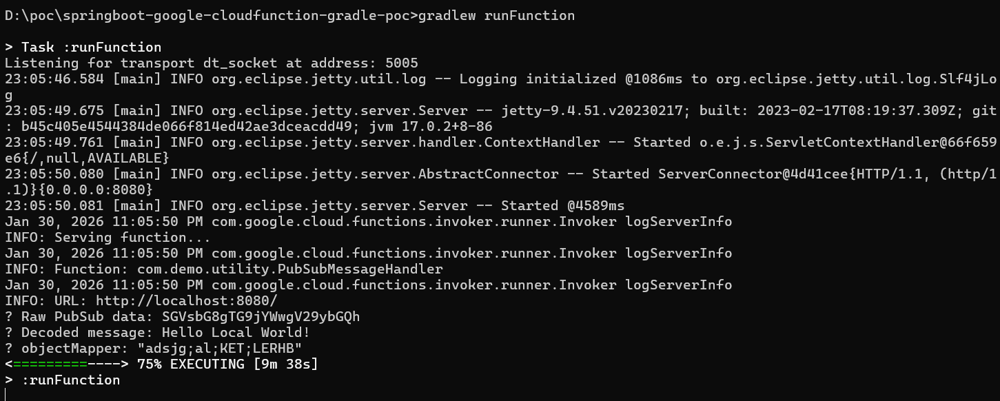
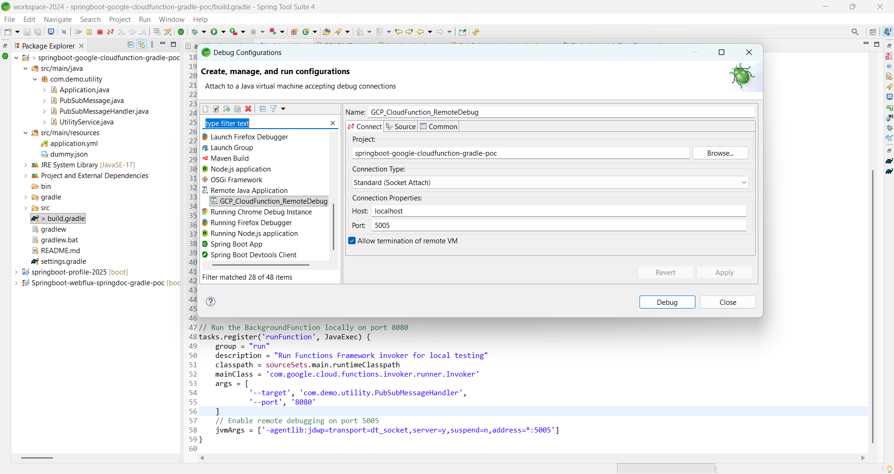
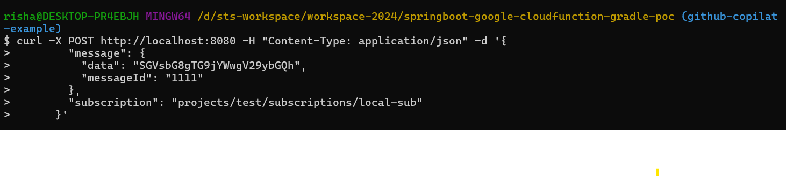
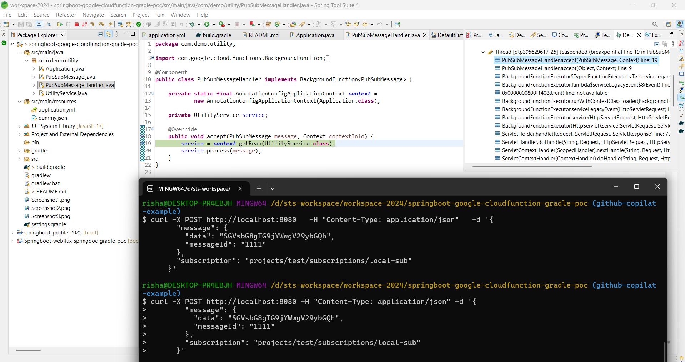

# Springboot CloudFucntion


# Build

	./gradlew clean build
	

# Local Run CloudFunction using functions-framework-api

	./gradlew runFunction


# API test:

```
 curl -X POST http://localhost:8080   -H "Content-Type: application/json"   -d '{
        "message": {
          "data": "SGVsbG8gTG9jYWwgV29ybGQh",
          "messageId": "1111"
        },
        "subscription": "projects/test/subscriptions/local-sub"
      }'
```




